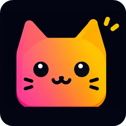
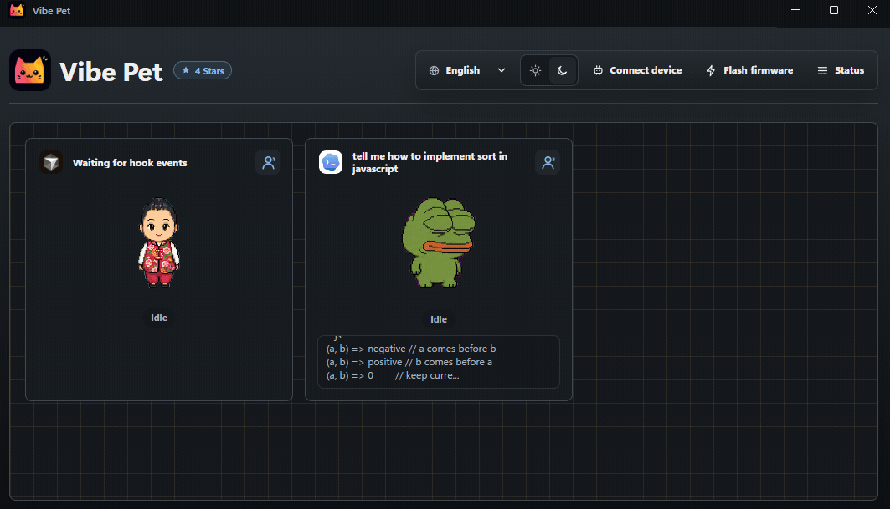
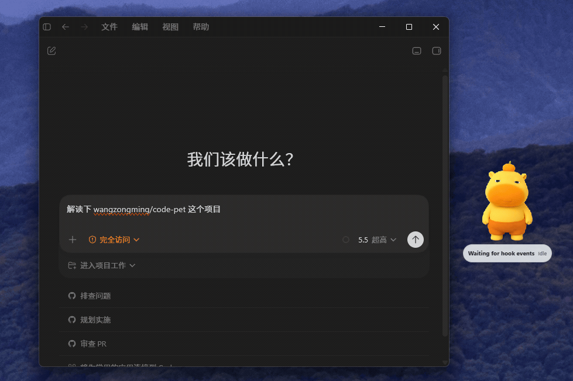

  

<h1 align="center">Vibe Pet</h1>

  <strong>Hardware desktop pets for your AI coding agents</strong> 
  <strong>Choose from thousands of characters or create your own in one click</strong> 
  Turn Codex, Cursor, Windsurf, and other agents into live companions across desktop and hardware

  English
  ·
  <a href="docs/protocol.md">Protocol</a>
  ·
  <a href="https://github.com/crafter-station/petdex">Petdex</a>
  ·
  <a href="README.zh-CN.md">中文</a>
  ·
  <a href="README.ja-JP.md">日本語</a>

  
  
  
  
  

Vibe Pet is a hardware desktop pet project for AI coding agents. It watches live activity from Codex, Cursor, Windsurf, and other AI coding agents in CLIs and IDEs, turns states such as thinking, tool use, waiting for approval, completed, and error into animated pets, then syncs the same state to Wio Terminal or ESP32-S3 hardware over BLE.

  
  

## Highlights

- Multi-agent pet view: every active editor or AI coding agent gets its own pet card instead of sharing one combined state.
- Real desktop pets: pets from the main window are also spawned onto the desktop, and each one can be dragged independently.
- Hardware sync: send state over Bluetooth to devices such as Wio Terminal or ESP-AI Mini Ext.
- Character switching: choose a character from [Petdex](https://github.com/crafter-station/petdex) by default or use a custom character you made.

## Supported Agents

Vibe Pet automatically tries to install or sync integrations for:

| Agent | Integration |
| --- | --- |
| Codex | Hooks and JSONL session monitoring |
| Cursor | Hooks |
| Windsurf | Cascade hooks |
| Claude CLI | Hooks |
| Claude Code | Hooks |
| Gemini CLI | Hooks |
| Copilot CLI | Hooks |
| CodeBuddy | Hooks |
| Kimi Code CLI | Hooks |
| Qwen Code | Hooks |
| OpenClaw | Plugin |
| opencode | Plugin |
| Qoder | Hooks |
| Hermes Agent | Plugin |
| Reasonix CLI | Hooks |

## Supported Hardware

| Hardware | Display / role | Sync | Adapted | Notes |
| --- | --- | --- | --- | --- |
| [Wio Terminal](https://www.seeedstudio.com/Wio-Terminal-p-4509.html) | Main animated pet display | BLE | ✅ | Mature BLE animated display target. |
| [ESP-AI-Mini AI Dev Board, 2.4-inch display](https://espai.fun/open/pcb/mini-ext/1.0.0/) | ESP32-S3-based AI dev kit | BLE | ✅ | TFT target; LVGL character rendering. |
| [ESP-AI v3 Dev Board, 2.4-inch display](https://espai.fun/open/pcb/common/3.0.0/) | ESP32-S3-based AI dev kit | BLE | ✅ | TFT target; LVGL character rendering. |
| [DIY ESP32S3](https://espai.fun/guide/1e7b8i8e/) | ESP32S3 dev board | BLE | ✅ | TFT target; LVGL character rendering. |
| [M5Stack Core2](https://docs.m5stack.com/en/core/core2) | 320x240 color touch display | BLE | ❌ | M5Unified color display target. |
| [M5Stack CoreS3](https://docs.m5stack.com/en/core/CoreS3) | ESP32-S3 color touch display | BLE | ✅ | M5Unified ESP32-S3 target. |
| [M5StickC Plus2](https://docs.m5stack.com/en/core/M5StickC%20PLUS2) | Compact color display | BLE | ❌ | Compact M5 color display. |
| [M5Stack Cardputer](https://docs.m5stack.com/en/core/Cardputer) | Keyboard device with color display | BLE | ❌ | Cardputer display target. |
| [M5Stack AtomS3](https://docs.m5stack.com/en/core/AtomS3) | Tiny ESP32-S3 color display | BLE | ❌ | Small-screen M5 target. |
| [LILYGO T-Display ESP32](https://www.lilygo.cc/products/t-display) | 1.14-inch ST7789 color display | BLE | ❌ | TFT_eSPI display target. |
| [LILYGO T-Display S3](https://www.lilygo.cc/products/t-display-s3) | ESP32-S3 ST7789 color display | BLE | ❌ | Parallel / ST7789 display target. |
| [Heltec WiFi Kit 32](https://heltec.org/project/wifi-kit-32-v3/) | ESP32 OLED display | BLE | ❌ | BLE OLED target. |
| [Heltec WiFi Kit 8](https://heltec.org/project/wifi-kit-8/) | ESP8266 OLED display | Wi-Fi polling | ❌ | Uses `/api/device-snapshot` polling. |
| [WEMOS D1 mini + OLED Shield](https://www.wemos.cc/en/latest/d1_mini_shield/oled_0_66.html) | ESP8266 OLED shield | Wi-Fi polling | ❌ | Uses `/api/device-snapshot` polling. |

Want to bring Vibe Pet to your own device? The BLE and Wi-Fi hardware payloads are intentionally small, so new screens, status lights, badges, and custom boards can be added without changing the desktop app.

## Download and Install

Download the installer for your platform from the [Releases page](https://github.com/wangzongming/vibe-pet/releases).

- macOS: download the `.dmg` or `.zip` build.
- Windows: download the `.exe` installer.
- Linux: download the `.AppImage` or `.deb` package.

After installation, launch Vibe Pet and use the desktop app to connect your device. You can also use Vibe Pet without hardware if you only want the desktop pets.

## Technical Documentation

- Project structure, local endpoints, BLE / Wi-Fi behavior, and hook mapping are documented in [AGENT.MD](AGENT.MD)
- Protocol documentation starts at the [protocol index](docs/protocol.md)
- English protocol docs:
  - [IDE / Agent protocol](docs/ide-protocol.md)
  - [hardware protocol](docs/hardware-protocol.md)
- Chinese protocol docs:
  - [IDE / Agent 协议](docs/ide-protocol.zh-CN.md)
  - [硬件协议](docs/hardware-protocol.zh-CN.md)

## Sponsor

## Contributing

Ideas, bug reports, hardware ports, new agent integrations, translations, and UI improvements are all welcome. If you want to contribute code, read [CONTRIBUTING.md](CONTRIBUTING.md) for development setup, packaging, testing, and PR guidance.
